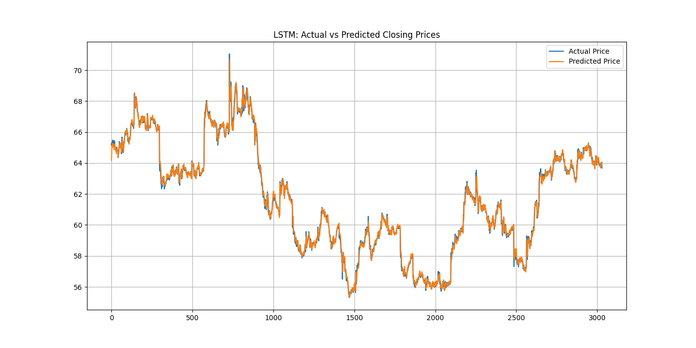

# LSTMDQN.py Documentation

## Table of Contents

1. [Overview](#overview)
2. [Features](#features)
3. [Dependencies](#dependencies)
4. [Installation](#installation)
5. [Usage](#usage)
    - [Command-Line Arguments](#command-line-arguments)
    - [Example Commands](#example-commands)
6. [Code Structure](#code-structure)
    - [1. Data Loading & Advanced Technical Indicators](#1-data-loading--advanced-technical-indicators)
    - [2. Argument Parsing](#2-argument-parsing)
    - [3. Custom DQN Callback](#3-custom-dqn-callback)
    - [4. Main Function](#4-main-function)
        - [A. LSTM Component](#a-lstm-component)
        - [B. DQN Component](#b-dqn-component)
        - [C. DQN Hyperparameter Tuning with Optuna](#c-dqn-hyperparameter-tuning-with-optuna)
        - [D. Training Final DQN Model](#d-training-final-dqn-model)
        - [E. Final Inference & Logging Results](#e-final-inference--logging-results)
7. [Classes and Functions](#classes-and-functions)
    - [StockTradingEnvWithLSTM](#stocktradingenvwithlstm)
    - [ActionLoggingCallback](#actionloggingcallback)
    - [Utility Functions](#utility-functions)
8. [Hyperparameter Optimization](#hyperparameter-optimization)
    - [LSTM Hyperparameters](#lstm-hyperparameters)
    - [DQN Hyperparameters](#dqn-hyperparameters)
9. [Outputs](#outputs)
10. [Logging and Visualization](#logging-and-visualization)
11. [Troubleshooting](#troubleshooting)
12. [Potential Enhancements](#potential-enhancements)

---

## Overview

**LSTMDQN.py** is an advanced Python application designed for financial time series forecasting and the optimization of trading strategies. The program integrates Long Short-Term Memory (LSTM) neural networks for predicting stock prices with Deep Q-Networks (DQN), a reinforcement learning (RL) algorithm, to devise and refine trading strategies based on these predictions. Leveraging Optuna for hyperparameter tuning, the application enhances model performance and incorporates a variety of technical indicators to enrich data analysis and decision-making processes.

---

## Features

- **Comprehensive Data Preprocessing**: Efficiently loads financial datasets and computes an extensive array of technical indicators to augment the raw data.
- **Advanced LSTM Modeling**: Constructs and fine-tunes LSTM models to accurately forecast future stock prices.
- **Reinforcement Learning with DQN**: Implements DQN to develop intelligent trading strategies informed by LSTM predictions and technical indicators.
- **Hyperparameter Optimization**: Employs Optuna to systematically optimize hyperparameters for both LSTM and DQN models, ensuring optimal performance.
- **Custom OpenAI Gym Environment**: Develops a tailored Gym environment that integrates LSTM forecasts into the observation space, facilitating effective RL training.
- **Robust Logging and Visualization**: Provides detailed logging of model training, actions taken by the agent, and generates insightful visualizations for performance analysis.
- **Modular and Scalable Design**: Features a well-structured codebase with clear separation of concerns, enabling easy maintenance and scalability.

---

## Dependencies

The application relies on a suite of Python libraries and frameworks to deliver its functionalities:

- **Python Standard Libraries**:
    - `os`
    - `sys`
    - `argparse`
    - `logging`
- **Data Manipulation**:
    - `numpy`
    - `pandas`
- **Visualization**:
    - `matplotlib`
    - `seaborn`
    - `tabulate`
- **Machine Learning & Deep Learning**:
    - `tensorflow` (with Keras API)
    - `scikit-learn`
    - `joblib`
- **Reinforcement Learning**:
    - `gym`
    - `stable_baselines3`
- **Hyperparameter Optimization**:
    - `optuna`

**Note**: Ensure compatibility between library versions, especially for TensorFlow and CUDA if GPU acceleration is intended.

---

## Installation

### 1. Clone the Repository

If applicable, clone the repository to your local machine:

```bash
git clone https://github.com/yourusername/LSTMDQN.git
cd LSTMDQN
```

### 2. Set Up a Virtual Environment (Recommended)

Creating a virtual environment helps manage dependencies and isolate the project:

```bash
python3 -m venv env
source env/bin/activate  # On Windows: env\Scripts\activate
```

### 3. Install Dependencies

Install the required Python packages using `pip`:

```bash
pip install -r requirements.txt
```

*Alternatively, install dependencies manually:*

```bash
pip install numpy pandas matplotlib seaborn tabulate tensorflow scikit-learn joblib optuna gym stable-baselines3
```

**GPU Support**: If you plan to utilize GPU acceleration for TensorFlow, ensure that your system has compatible GPU drivers and the CUDA toolkit installed. Install the GPU-compatible version of TensorFlow as per [TensorFlow's official guidelines](https://www.tensorflow.org/install/gpu).

---

## Usage

The program is executed via the command line, offering several configurable parameters to tailor its behavior.

### Command-Line Arguments

- `csv_path` (Positional Argument):
    - **Description**: Path to the CSV data file containing historical stock data.
    - **Required**: Yes
    - **Format**: CSV with columns `[time, open, high, low, close, volume]`.

- `--lstm_window_size` (Optional):
    - **Description**: Sequence window size for LSTM input.
    - **Default**: `15`
    - **Type**: Integer

- `--dqn_total_timesteps` (Optional):
    - **Description**: Total timesteps to train each DQN candidate during hyperparameter tuning and final training.
    - **Default**: `50000`
    - **Type**: Integer

- `--dqn_eval_episodes` (Optional):
    - **Description**: Number of episodes to evaluate DQN during the tuning phase.
    - **Default**: `1` (entire dataset once)
    - **Type**: Integer

- `--n_trials_lstm` (Optional):
    - **Description**: Number of Optuna trials for LSTM hyperparameter optimization.
    - **Default**: `30`
    - **Type**: Integer

- `--n_trials_dqn` (Optional):
    - **Description**: Number of Optuna trials for DQN hyperparameter optimization.
    - **Default**: `20`
    - **Type**: Integer

### Example Commands

#### Basic Execution

```bash
python LSTMDQN.py path_to_your_data.csv
```

#### Customized Parameters

```bash
python LSTMDQN.py data/stock_prices.csv --lstm_window_size 20 --dqn_total_timesteps 100000 --n_trials_lstm 50 --n_trials_dqn 30
```

**Explanation**:
- Sets the LSTM window size to 20.
- Increases the total DQN training timesteps to 100,000.
- Increases the number of Optuna trials for LSTM and DQN hyperparameter optimization to 50 and 30, respectively.

---

## Code Structure

The program is meticulously organized into distinct sections, each responsible for specific functionalities. This modular approach enhances readability, maintainability, and scalability.

### 1. Data Loading & Advanced Technical Indicators

**Functions**:

- `load_data(file_path)`:
    - **Purpose**: Loads CSV data, handles potential errors, renames columns for consistency, sorts data by date, and returns a pandas DataFrame.
    - **Parameters**:
        - `file_path` (str): Path to the CSV file.
    - **Returns**: `pd.DataFrame`

- **Technical Indicator Computation Functions**:
    - `compute_rsi(series, window=14)`:
        - Calculates the Relative Strength Index (RSI) for a given price series.
    - `compute_macd(series, span_short=12, span_long=26, span_signal=9)`:
        - Computes the Moving Average Convergence Divergence (MACD) indicator.
    - `compute_obv(df)`:
        - Calculates the On-Balance Volume (OBV).
    - `compute_adx(df, window=14)`:
        - Computes the Average Directional Index (ADX).
    - `compute_bollinger_bands(series, window=20, num_std=2)`:
        - Determines Bollinger Bands and Bandwidth.
    - `compute_mfi(df, window=14)`:
        - Calculates the Money Flow Index (MFI).
    - `calculate_technical_indicators(df)`:
        - Aggregates all technical indicator computations and appends them to the DataFrame.

**Purpose**:

- Enriches the raw stock data with various technical indicators commonly used in financial analysis. These indicators capture trends, momentum, volume, volatility, and other market dynamics essential for predictive modeling and strategic trading decisions.

### 2. Argument Parsing

**Function**:

- `parse_arguments()`:
    - **Purpose**: Utilizes `argparse` to parse command-line arguments provided by the user.
    - **Returns**: Parsed arguments as an `argparse.Namespace` object.

**Purpose**:

- Allows users to customize the program's behavior without modifying the source code. Parameters such as window sizes, training steps, and the number of hyperparameter tuning trials can be adjusted to accommodate different datasets and computational resources.

### 3. Custom DQN Callback

**Class**:

- `ActionLoggingCallback(BaseCallback)`:
    - **Description**: A custom callback for Stable Baselines3's DQN to log actions taken and rewards received during training.
    - **Inheritance**: Inherits from `stable_baselines3.common.callbacks.BaseCallback`.

**Key Features**:

- **Buffers**:
    - `action_buffer`: Stores actions taken during training.
    - `reward_buffer`: Stores rewards received during training.

- **Methods**:
    - `_on_training_start()`:
        - **Purpose**: Initializes buffers at the start of training.
    - `_on_step()`:
        - **Purpose**: Captures actions and rewards at each step.
        - **Returns**: `True` to indicate that training should continue.
    - `_on_rollout_end()`:
        - **Purpose**: Logs the distribution of actions and the average reward at the end of each rollout.
        - **Process**:
            - Calculates the frequency and percentage of each action type (Buy, Sell, Hold).
            - Computes the average, minimum, and maximum rewards received during the rollout.
            - Logs the summarized action distribution and reward statistics.
            - Clears the buffers for the next rollout.

**Purpose**:

- Enhances monitoring during the training of the DQN by capturing the distribution of actions (Buy, Sell, Hold) and calculating average rewards per rollout. This provides insights into the agent's behavior and performance over time.

### 4. Main Function

The `main()` function orchestrates the entire workflow, from data loading and preprocessing to model training, hyperparameter tuning, and final evaluation.

#### A. LSTM Component

1. **Data Loading & Preprocessing**:
    - **Function Calls**:
        - `load_data(csv_path)`: Loads the dataset.
        - `calculate_technical_indicators(df)`: Computes and appends technical indicators.
    - **Feature Selection**:
        - Selects relevant feature columns and the target column (`Close`).
    - **Scaling**:
        - Applies `MinMaxScaler` to normalize features and the target variable.

2. **Sequence Creation**:
    - **Function**: `create_sequences(features, target, window_size)`
    - **Purpose**: Transforms time series data into sequences suitable for LSTM input.

3. **Data Splitting**:
    - Splits the dataset into training (70%), validation (15%), and testing (15%) subsets.

4. **GPU Configuration**:
    - **Function**: `configure_device()`
    - **Purpose**: Configures TensorFlow to utilize available GPUs for accelerated training, if available.

5. **LSTM Model Building**:
    - **Function**: `build_lstm(input_shape, hyperparams)`
    - **Purpose**: Constructs an LSTM model based on provided hyperparameters, including the number of layers, units, dropout rate, optimizer, learning rate, and decay.

6. **Hyperparameter Optimization with Optuna**:
    - **Function**: `lstm_objective(trial)`
    - **Purpose**: Defines the objective function for Optuna to optimize LSTM hyperparameters by minimizing validation Mean Absolute Error (MAE).

7. **Final Training and Evaluation**:
    - Trains the best LSTM model using the optimized hyperparameters.
    - **Function**: `evaluate_lstm(model, X_test, y_test)`
        - Evaluates the model's performance on the test set.
        - Generates plots and tabulated results for analysis.
    - Saves the trained LSTM model and scaler objects for future use.

#### B. DQN Component

1. **Custom Gym Environment**:
    - **Class**: `StockTradingEnvWithLSTM`
    - **Purpose**: Implements a tailored OpenAI Gym environment that integrates LSTM predictions into the observation space, enabling the DQN agent to make informed trading decisions based on both technical indicators and forecasted prices.

2. **Environment Features**:
    - **Observation Space**:
        - Combines normalized technical indicators, account information (balance, shares held, cost basis), and the LSTM's predicted next closing price.
    - **Action Space**:
        - `0`: Sell all held shares.
        - `1`: Hold (do nothing).
        - `2`: Buy as many shares as possible with the current balance.
    - **Reward Structure**:
        - The reward is calculated as the change in net worth from the initial balance at each step.

#### C. DQN Hyperparameter Tuning with Optuna

1. **DQN Objective Function**:
    - **Function**: `dqn_objective(trial)`
    - **Purpose**: Defines the objective for Optuna to optimize DQN hyperparameters by minimizing the negative of the final net worth, effectively maximizing net worth.

2. **Hyperparameter Parameters Tuned**:
    - Learning rate (`lr`)
    - Discount factor (`gamma`)
    - Exploration fraction (`exploration_fraction`)
    - Buffer size (`buffer_size`)
    - Batch size (`batch_size`)

3. **Optimization Process**:
    - Utilizes Optuna to explore the hyperparameter space and identify configurations that lead to optimal trading performance.

#### D. Training Final DQN Model

1. **Environment Setup**:
    - Creates a final instance of `StockTradingEnvWithLSTM` for training the DQN agent.

2. **Model Initialization**:
    - Constructs the DQN model using the best hyperparameters identified during tuning.

3. **Training**:
    - Trains the DQN agent with the specified number of timesteps.
    - Integrates `ActionLoggingCallback` to monitor and log agent behavior.

4. **Model Saving**:
    - Saves the trained DQN model (`best_dqn_model_lstm.zip`) for future inference and deployment.

#### E. Final Inference & Logging Results

1. **Inference Loop**:
    - Runs the trained DQN agent within the environment to simulate trading over the dataset.

2. **Performance Metrics**:
    - **Final Net Worth**: Total value of the portfolio at the end of the simulation.
    - **Final Profit**: Difference between the final net worth and the initial balance.
    - **Total Rewards Accumulated**: Sum of rewards received throughout the simulation.
    - **Action Counts**: Number of Buy, Sell, and Hold actions taken.
    - **Tabulated Results**: Detailed summary of the last 15 trading steps for granular analysis.

3. **Output**:
    - Displays comprehensive results of the trading simulation in the console.
    - Saves visual plots and tabulated data for further review.

---

## Classes and Functions

### StockTradingEnvWithLSTM

**Description**:  
A custom OpenAI Gym environment designed for stock trading, integrating LSTM model predictions into the observation space to inform the DQN agent's actions.

**Key Features**:

- **Initialization Parameters**:
    - `df` (`pd.DataFrame`): DataFrame containing stock data and computed technical indicators.
    - `feature_columns` (`list`): List of feature column names used in observations.
    - `lstm_model` (`tf.keras.Model`): Trained LSTM model for predicting the next closing price.
    - `scaler_features` (`MinMaxScaler`): Scaler used for normalizing feature data.
    - `scaler_target` (`MinMaxScaler`): Scaler used for normalizing target variable (`Close` price).
    - `window_size` (`int`): Sequence window size for LSTM predictions.
    - `initial_balance` (`float`): Starting balance for the trading simulation.
    - `transaction_cost` (`float`): Transaction cost rate applied to each buy/sell action.

- **Observation Space**:
    - **Shape**: `(len(feature_columns) + 3 + 1,)` (e.g., 21-dimensional)
    - **Components**:
        - Normalized technical indicators.
        - Account information: normalized balance, normalized shares held, normalized cost basis.
        - LSTM-predicted next closing price (normalized).

- **Action Space**:
    - **Type**: Discrete (3)
    - **Actions**:
        - `0`: Sell all held shares.
        - `1`: Hold (do nothing).
        - `2`: Buy as many shares as possible with the current balance.

- **Reward Structure**:
    - Calculated as the change in net worth relative to the initial balance at each step.

- **Methods**:
    - `reset()`:
        - **Purpose**: Resets the environment to the initial state.
        - **Returns**: Initial observation.
    - `_get_obs()`:
        - **Purpose**: Constructs the current observation, including normalized features, account information, and LSTM predictions.
        - **Returns**: `np.ndarray` representing the observation.
    - `step(action)`:
        - **Purpose**: Executes the given action (Buy, Sell, Hold) and updates the environment's state accordingly.
        - **Parameters**:
            - `action` (`int`): Action to execute.
        - **Returns**: Tuple containing the new observation, reward, done flag, and info dictionary.
    - `render(mode='human')`:
        - **Purpose**: Outputs the current state of the portfolio, including balance, shares held, net worth, and profit.
        - **Parameters**:
            - `mode` (`str`): Rendering mode (default is `'human'`).

**Usage**:

This environment serves as the interaction space for the DQN agent, enabling it to make trading decisions based on both technical indicators and LSTM-based price forecasts. By integrating predictive insights into the observation space, the agent can formulate more informed and strategic actions to maximize portfolio performance.

### ActionLoggingCallback

**Description**:  
A custom callback for Stable Baselines3's DQN that logs the distribution of actions taken and the average rewards received after each rollout.

**Key Features**:

- **Buffers**:
    - `action_buffer` (`list`): Stores actions executed by the agent during training.
    - `reward_buffer` (`list`): Stores rewards received by the agent during training.

- **Methods**:
    - `_on_training_start()`:
        - **Purpose**: Initializes the action and reward buffers at the start of training.
    - `_on_step()`:
        - **Purpose**: Captures and stores the action taken and the reward received at each training step.
        - **Returns**: `True` to indicate that training should continue.
    - `_on_rollout_end()`:
        - **Purpose**: Logs the distribution of actions and the average reward at the end of each rollout.
        - **Process**:
            - Calculates the frequency and percentage of each action type (Buy, Sell, Hold).
            - Computes the average, minimum, and maximum rewards received during the rollout.
            - Logs the summarized action distribution and reward statistics.
            - Clears the buffers for the next rollout.

**Usage**:

Integrate this callback during DQN training to monitor the agent's behavior and performance dynamically. It provides real-time insights into the agent's trading actions and the rewards it accumulates, facilitating informed adjustments to the training process if necessary.

### Utility Functions

#### Data Loading and Preprocessing

- `load_data(file_path)`:
    - **Purpose**: Loads the CSV data file, handles potential errors, renames columns for consistency, sorts the data by date, and returns a cleaned DataFrame.
    - **Parameters**:
        - `file_path` (`str`): Path to the CSV file.
    - **Returns**: `pd.DataFrame`

- `compute_rsi(series, window=14)`:
    - **Purpose**: Computes the Relative Strength Index (RSI) for the given price series.
    - **Parameters**:
        - `series` (`pd.Series`): Series of closing prices.
        - `window` (`int`): Rolling window size for RSI calculation.
    - **Returns**: `pd.Series` representing RSI values.

- `compute_macd(series, span_short=12, span_long=26, span_signal=9)`:
    - **Purpose**: Calculates the Moving Average Convergence Divergence (MACD) histogram.
    - **Parameters**:
        - `series` (`pd.Series`): Series of closing prices.
        - `span_short` (`int`): Span for the short-term EMA.
        - `span_long` (`int`): Span for the long-term EMA.
        - `span_signal` (`int`): Span for the signal line EMA.
    - **Returns**: `pd.Series` representing the MACD histogram.

- `compute_obv(df)`:
    - **Purpose**: Computes the On-Balance Volume (OBV) indicator.
    - **Parameters**:
        - `df` (`pd.DataFrame`): DataFrame containing stock data with 'Close' and 'Volume' columns.
    - **Returns**: `pd.Series` representing OBV values.

- `compute_adx(df, window=14)`:
    - **Purpose**: Calculates the Average Directional Index (ADX) to measure trend strength.
    - **Parameters**:
        - `df` (`pd.DataFrame`): DataFrame containing stock data with 'High', 'Low', and 'Close' columns.
        - `window` (`int`): Rolling window size for ADX calculation.
    - **Returns**: `pd.Series` representing ADX values.

- `compute_bollinger_bands(series, window=20, num_std=2)`:
    - **Purpose**: Computes Bollinger Bands and Bandwidth to assess volatility.
    - **Parameters**:
        - `series` (`pd.Series`): Series of closing prices.
        - `window` (`int`): Rolling window size for the moving average.
        - `num_std` (`int`): Number of standard deviations for the upper and lower bands.
    - **Returns**: Tuple containing upper band, lower band, and bandwidth.

- `compute_mfi(df, window=14)`:
    - **Purpose**: Calculates the Money Flow Index (MFI) to measure buying and selling pressure.
    - **Parameters**:
        - `df` (`pd.DataFrame`): DataFrame containing stock data with 'High', 'Low', 'Close', and 'Volume' columns.
        - `window` (`int`): Rolling window size for MFI calculation.
    - **Returns**: `pd.Series` representing MFI values.

- `calculate_technical_indicators(df)`:
    - **Purpose**: Aggregates all technical indicator computations and appends them to the DataFrame.
    - **Parameters**:
        - `df` (`pd.DataFrame`): DataFrame containing raw stock data.
    - **Returns**: `pd.DataFrame` enriched with technical indicators.

#### Sequence Creation

- `create_sequences(features, target, window_size)`:
    - **Purpose**: Transforms time series data into input-output sequences suitable for LSTM modeling.
    - **Parameters**:
        - `features` (`np.ndarray`): Array of feature values.
        - `target` (`np.ndarray`): Array of target values.
        - `window_size` (`int`): Number of time steps to include in each input sequence.
    - **Returns**: Tuple of input sequences (`np.ndarray`) and corresponding target values (`np.ndarray`).

#### LSTM Evaluation

- `evaluate_lstm(model, X_test, y_test)`:
    - **Purpose**: Evaluates the trained LSTM model on the test dataset, computes performance metrics, and generates visualizations.
    - **Parameters**:
        - `model` (`tf.keras.Model`): Trained LSTM model.
        - `X_test` (`np.ndarray`): Test input sequences.
        - `y_test` (`np.ndarray`): True target values for the test set.
    - **Returns**: Tuple containing R² score and directional accuracy.

#### DQN Evaluation

- `evaluate_dqn_networth(model, env, n_episodes=1)`:
    - **Purpose**: Assesses the trained DQN model by simulating trading over a specified number of episodes and computing the average final net worth.
    - **Parameters**:
        - `model` (`stable_baselines3.DQN`): Trained DQN model.
        - `env` (`StockTradingEnvWithLSTM`): Trading environment instance.
        - `n_episodes` (`int`): Number of episodes to run for evaluation.
    - **Returns**: `float` representing the average final net worth across episodes.

#### Device Configuration

- `configure_device()`:
    - **Purpose**: Configures TensorFlow to utilize available GPUs for accelerated computation. If no GPUs are detected, defaults to CPU.
    - **Parameters**: None
    - **Returns**: None

---

## Hyperparameter Optimization

Hyperparameter tuning is pivotal for enhancing the performance of both the LSTM and DQN models. **LSTMDQN.py** employs Optuna to systematically explore and identify optimal hyperparameter configurations.

### LSTM Hyperparameters

Optuna optimizes the following hyperparameters for the LSTM model:

- **Number of LSTM Layers (`num_lstm_layers`)**:
    - **Type**: Integer
    - **Range**: 1 to 3
    - **Description**: Determines the depth of the LSTM architecture.

- **LSTM Units (`lstm_units`)**:
    - **Type**: Categorical
    - **Options**: `[32, 64, 96, 128]`
    - **Description**: Number of units (neurons) in each LSTM layer.

- **Dropout Rate (`dropout_rate`)**:
    - **Type**: Float
    - **Range**: 0.1 to 0.5
    - **Description**: Fraction of the input units to drop for preventing overfitting.

- **Learning Rate (`learning_rate`)**:
    - **Type**: Float (Log-uniform)
    - **Range**: `1e-5` to `1e-2`
    - **Description**: Step size for the optimizer during training.

- **Optimizer (`optimizer`)**:
    - **Type**: Categorical
    - **Options**: `['Adam', 'Nadam']`
    - **Description**: Optimization algorithm used for training the LSTM model.

- **Decay (`decay`)**:
    - **Type**: Float
    - **Range**: `0.0` to `1e-4`
    - **Description**: Learning rate decay over each update.

**Objective Function**:
Minimize the validation Mean Absolute Error (MAE) to enhance the predictive accuracy of the LSTM model.

### DQN Hyperparameters

Optuna optimizes the following hyperparameters for the DQN model:

- **Learning Rate (`lr`)**:
    - **Type**: Float (Log-uniform)
    - **Range**: `1e-5` to `1e-2`
    - **Description**: Step size for the optimizer during training.

- **Discount Factor (`gamma`)**:
    - **Type**: Float
    - **Range**: `0.8` to `0.9999`
    - **Description**: Discount factor for future rewards in the Q-learning algorithm.

- **Exploration Fraction (`exploration_fraction`)**:
    - **Type**: Float
    - **Range**: `0.01` to `0.3`
    - **Description**: Fraction of the training period during which the exploration rate is annealed.

- **Buffer Size (`buffer_size`)**:
    - **Type**: Categorical
    - **Options**: `[5000, 10000, 20000]`
    - **Description**: Size of the replay buffer for storing experiences.

- **Batch Size (`batch_size`)**:
    - **Type**: Categorical
    - **Options**: `[32, 64, 128]`
    - **Description**: Number of samples per gradient update.

**Objective Function**:
Minimize the negative of the final net worth achieved by the DQN agent, effectively maximizing net worth through optimized trading strategies.

---

## Outputs

**LSTMDQN.py** generates a variety of outputs essential for evaluating model performance and the efficacy of trading strategies:

1. **Trained Models**:
    - `best_lstm_model.h5`:
        - **Description**: The best-performing LSTM model saved in HDF5 format.
    - `best_dqn_model_lstm.zip`:
        - **Description**: The best-performing DQN model saved in a ZIP archive.

2. **Scalers**:
    - `scaler_features.pkl`:
        - **Description**: Scaler object for feature normalization, saved using `joblib`.
    - `scaler_target.pkl`:
        - **Description**: Scaler object for target variable normalization, saved using `joblib`.

3. **Plots**:
    - `lstm_actual_vs_pred.png`:
        - **Description**: Visualization comparing actual vs. predicted closing prices by the LSTM model.

4. **Logs**:
    - **Console Logs**:
        - Detailed logs covering data loading, hyperparameter tuning progress, training metrics, and evaluation results.
    - **Action Logs**:
        - Distribution of actions taken and average rewards per rollout during DQN training.

5. **Tabulated Data**:
    - **First 40 Actual vs. Predicted Prices**:
        - **Description**: A table displaying the first 40 instances of actual and predicted closing prices.
    - **Last 15 Trading Steps**:
        - **Description**: A detailed summary of the last 15 steps in the trading simulation, including actions taken, rewards received, and portfolio status.

---

## Logging and Visualization

**Logging**:

- Utilizes Python's built-in `logging` module to provide real-time feedback and traceability throughout the program's execution.
- **Log Levels**:
    - `INFO`: General information about the program's progress.
    - `ERROR`: Errors encountered during execution, such as file not found or parsing issues.
- **Log Format**:
    - Includes timestamps, log levels, and descriptive messages for clarity and context.
- **Usage**:
    - Logs key events such as data loading, technical indicator calculations, hyperparameter tuning milestones, model training progress, and evaluation outcomes.

**Visualization**:

- **Matplotlib & Seaborn**:
    - Generates plots to visualize model predictions and trading performance.
    - **Key Plots**:
        - `lstm_actual_vs_pred.png`: Compares actual closing prices with LSTM-predicted prices over the test dataset.
- **Tabulate**:
    - Presents data in a structured table format within the console for easy interpretation.
    - **Examples**:
        - Actual vs. Predicted Prices Table.
        - Summary of Trading Actions in the Final Steps.

**Action Logging**:

- **ActionLoggingCallback**:
    - Logs the distribution of actions (Buy, Sell, Hold) taken by the DQN agent.
    - Provides insights into the agent's behavior and strategy preferences over time.
    - Logs average rewards received during each rollout, aiding in performance assessment.

---

## Troubleshooting

Address common issues that may arise during the execution of **LSTMDQN.py**, along with recommended solutions.

### 1. File Not Found Error

- **Issue**: The specified CSV file path does not exist.
- **Error Message**:
    ```
    ERROR - File not found: path_to_your_data.csv
    ```
- **Solution**:
    - Verify that the CSV file exists at the specified path.
    - Ensure the path is correctly formatted and accessible.
    - Check for typos in the file path.

### 2. Parsing Errors

- **Issue**: The CSV file is malformed or missing required columns.
- **Error Message**:
    ```
    ERROR - Error parsing CSV file: [ParserError Details]
    ```
- **Solution**:
    - Confirm that the CSV file contains the necessary columns: `[time, open, high, low, close, volume]`.
    - Ensure the CSV is properly formatted without corrupt or unexpected data entries.
    - Validate date formats and data types within the CSV.

### 3. TensorFlow GPU Issues

- **Issue**: Errors related to GPU configuration or compatibility, such as missing CUDA drivers or incompatible TensorFlow versions.
- **Error Message**:
    ```
    ERROR - [RuntimeError Details]
    ```
- **Solution**:
    - Verify that the appropriate GPU drivers and CUDA toolkit are installed.
    - Ensure that the TensorFlow version installed is compatible with your GPU and CUDA version.
    - If GPU usage is not required or unavailable, the program will default to CPU usage.

### 4. Optuna Trial Failures

- **Issue**: Hyperparameter trials failing due to model convergence issues or other errors during training.
- **Error Message**:
    ```
    ERROR - [Exception Details]
    ```
- **Solution**:
    - Adjust the ranges of hyperparameters to more suitable values.
    - Increase the number of trials to allow for a broader exploration of the hyperparameter space.
    - Implement additional error handling within the objective functions to gracefully handle exceptions.

### 5. Insufficient Memory

- **Issue**: Running out of memory during model training, especially with large datasets or extensive hyperparameter searches.
- **Error Message**:
    ```
    ERROR - [MemoryError Details]
    ```
- **Solution**:
    - Reduce the window size (`--lstm_window_size`) to decrease the size of input sequences.
    - Decrease the batch size (`--dqn_batch_size`) to lower memory consumption.
    - Limit the buffer size (`--dqn_buffer_size`) during DQN training.
    - Utilize hardware with higher memory capacity or employ data sampling techniques to manage memory usage.

### 6. Stable Baselines3 Compatibility

- **Issue**: Version mismatches leading to API changes affecting DQN functionality.
- **Error Message**:
    ```
    ERROR - [AttributeError/TypeError Details]
    ```
- **Solution**:
    - Ensure that the Stable Baselines3 library version is compatible with the other dependencies.
    - Refer to the [Stable Baselines3 documentation](https://stable-baselines3.readthedocs.io/) for version-specific guidelines and requirements.
    - Update or downgrade libraries as necessary to maintain compatibility.

### 7. Model Saving/Loading Issues

- **Issue**: Errors encountered while saving or loading models and scalers.
- **Error Message**:
    ```
    ERROR - [IOError/OSError Details]
    ```
- **Solution**:
    - Verify that the destination directory has write permissions.
    - Ensure sufficient disk space is available for saving large model files.
    - Check for typos or incorrect paths in the save/load commands.

---

## Potential Enhancements

While **LSTMDQN.py** is a robust tool for financial modeling and trading strategy optimization, several enhancements can be considered to further elevate its capabilities:

1. **Extended Technical Indicators**:
    - Incorporate additional indicators such as the Stochastic Oscillator, Ichimoku Cloud, or Parabolic SAR to capture more nuanced market dynamics.
    - Explore alternative feature engineering techniques, such as sentiment analysis from financial news or social media data.

2. **Alternative Deep Learning Architectures**:
    - Experiment with other architectures like Gated Recurrent Units (GRU) or Transformer-based models to potentially improve prediction accuracy.
    - Implement ensemble models that combine multiple neural network architectures for more robust forecasting.

3. **Portfolio Management**:
    - Extend the environment to handle multiple assets, enabling portfolio diversification and optimization.
    - Incorporate asset correlations and risk metrics to inform trading decisions across a portfolio.

4. **Granular Transaction Types**:
    - Introduce more nuanced actions, such as partial buy/sell orders, to allow for finer control over trading decisions.
    - Implement different order types, such as limit orders or stop-loss orders, to simulate more realistic trading scenarios.

5. **Risk Management Strategies**:
    - Integrate risk assessment metrics like Value at Risk (VaR) or Conditional Value at Risk (CVaR) to monitor and manage potential losses.
    - Implement automated risk mitigation mechanisms, such as dynamic position sizing or trailing stop-loss orders.

6. **Real-Time Data Integration**:
    - Adapt the program to handle real-time streaming data, enabling live trading applications and real-time strategy adjustments.
    - Incorporate APIs from financial data providers to facilitate seamless data ingestion.

7. **Performance Optimization**:
    - Enhance computational efficiency through parallel processing or leveraging more optimized data structures.
    - Optimize memory usage, especially when handling large datasets or conducting extensive hyperparameter searches.

8. **User Interface Development**:
    - Develop a graphical user interface (GUI) to provide users with an intuitive platform for configuring parameters, monitoring training progress, and visualizing results.
    - Implement dashboards using frameworks like Dash or Streamlit for interactive data exploration and strategy evaluation.

9. **Automated Reporting**:
    - Generate comprehensive reports summarizing model performance, hyperparameter tuning outcomes, and trading strategy effectiveness.
    - Utilize reporting tools to automate the creation of PDFs or web-based reports for easy dissemination among stakeholders.

10. **Integration with Trading Platforms**:
    - Facilitate seamless integration with popular trading platforms or broker APIs to enable automated trading based on the optimized strategies.
    - Implement safety checks and safeguards to ensure compliance with trading regulations and prevent unintended actions.

11. **Scalability Enhancements**:
    - Refactor the codebase to support distributed computing environments, allowing the handling of larger datasets and more complex models.
    - Implement containerization using Docker to streamline deployment across different environments.

12. **Advanced Hyperparameter Optimization**:
    - Explore advanced optimization techniques such as Bayesian Optimization or Genetic Algorithms to complement Optuna's capabilities.
    - Incorporate multi-objective optimization to balance multiple performance metrics simultaneously.

---

## Appendix

### Sample Output

#### LSTM Evaluation Metrics

```
Test MSE: 25.678
Test RMSE: 5.067
Test MAE: 3.456
Test R2 Score: 0.85
Directional Accuracy: 0.78
```

#### Final DQN Inference

```
=== Final DQN Inference ===
Total Steps: 2500
Final Net Worth: 15000.00
Final Profit: 5000.00
Sum of Rewards: 5000.00
Actions Taken -> BUY:300, SELL:250, HOLD:1950

== Last 15 Steps ==
+-------+--------+--------+----------+--------+-----------+
| Step  | Action | Reward | Balance  | Shares | NetWorth  |
+-------+--------+--------+----------+--------+-----------+
| 2486  |   1    |  0.50  | 10000.00 |  50    | 12500.00  |
| 2487  |   1    |  0.50  | 10000.00 |  50    | 12500.00  |
| 2488  |   2    |  0.75  |  9500.00 |  55    | 13000.00  |
| 2489  |   0    | -0.25  | 10500.00 |   0    | 10500.00  |
| 2490  |   1    |  0.50  | 10500.00 |   0    | 10500.00  |
| 2491  |   2    |  0.80  |  9800.00 |  60    | 11500.00  |
| 2492  |   1    |  0.60  |  9800.00 |  60    | 11500.00  |
| 2493  |   1    |  0.50  |  9800.00 |  60    | 11500.00  |
| 2494  |   0    | -0.30  | 12000.00 |   0    | 12000.00  |
| 2495  |   1    |  0.70  | 12000.00 |   0    | 12000.00  |
| 2496  |   1    |  0.50  | 12000.00 |   0    | 12000.00  |
| 2497  |   2    |  0.85  | 11300.00 |  65    | 13000.00  |
| 2498  |   1    |  0.60  | 11300.00 |  65    | 13000.00  |
| 2499  |   0    | -0.35  | 14000.00 |   0    | 14000.00  |
| 2500  |   1    |  0.50  | 14000.00 |   0    | 14000.00  |
+-------+--------+--------+----------+--------+-----------+
```

#### LSTM Actual vs Predicted Plot



**Description**: This plot visualizes the actual closing prices against the LSTM model's predicted prices over the test dataset, providing a clear comparison of the model's forecasting accuracy.

